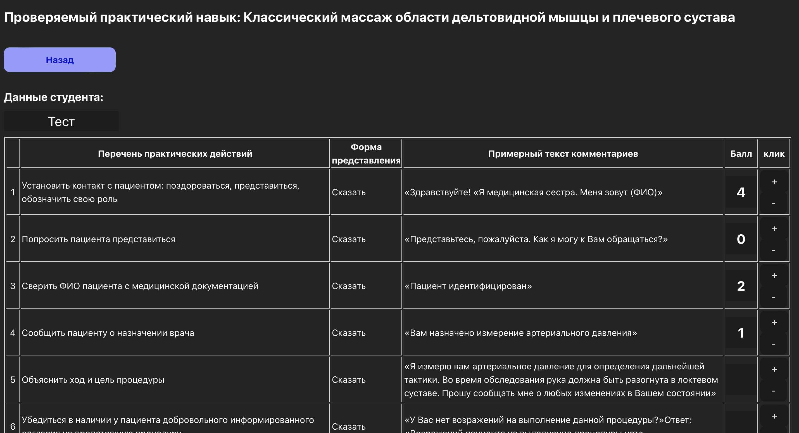
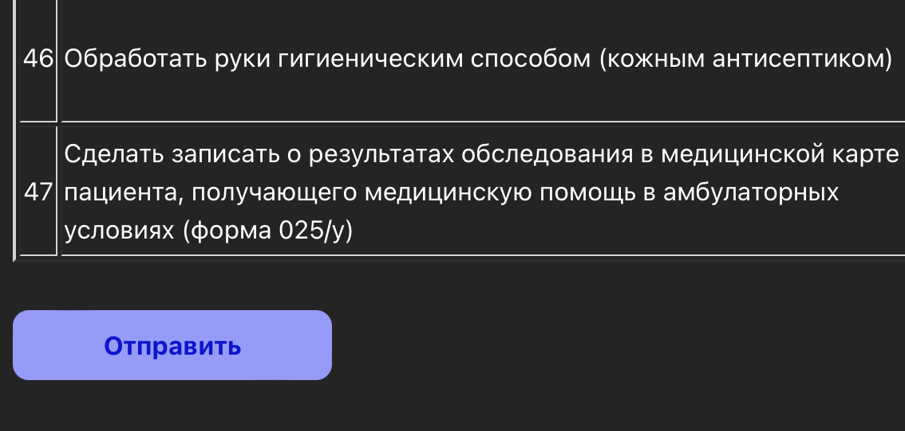
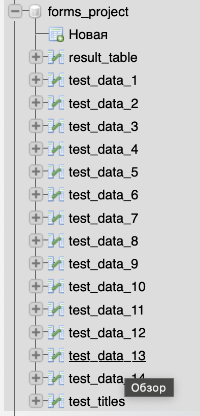
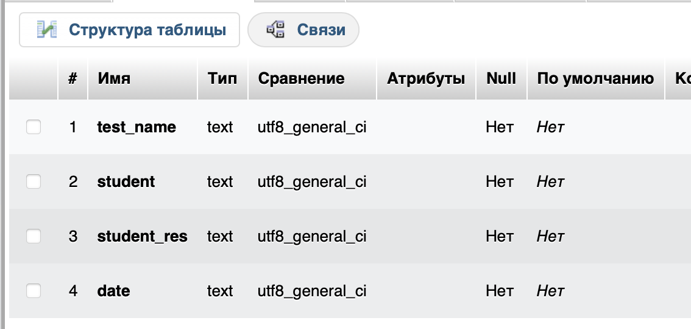
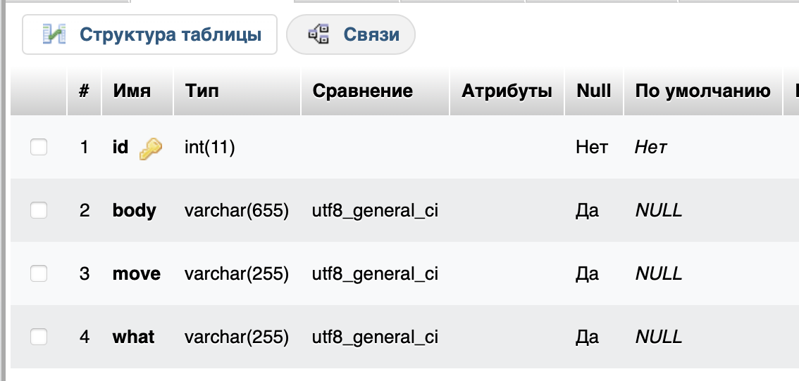
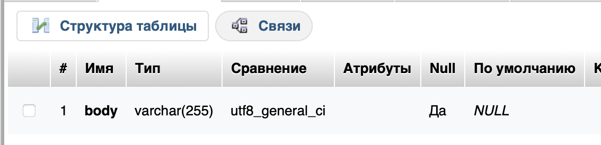
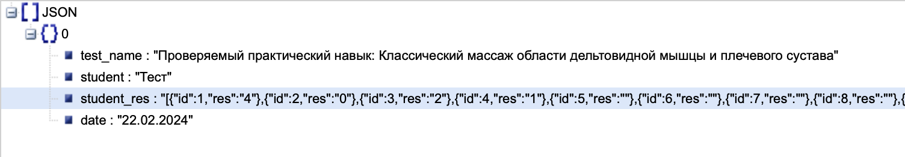

# SPA приложение для проведения тестирований

1. [Что делает проект?](#section1)
2. [Как это работает?](#section2)
3. [Как выглядит база данных (MySql)?](#section3)
4. [Как начать использовать?](#section4)

## <a name="section1"></a> Что делает проект?
Это одностраничное приложение (SPA), цель которого состоит в тестировании. Оно предоставляет пользователю несколько страниц:

1. Главная страница со списком тестов:
  - На этой странице пользователь может просматривать доступные тесты для прохождения.
2. Страница выбранного теста с содержимым: 
  - Здесь пользователь может видеть вопросы и возможные варианты ответов, а также референсы для ответов. Каждый ответ оценивается в баллах.
3. Результат отправки данных

Все данные о вопросах и самих тестах хранятся в MySQL. После прохождения теста результаты отправляются так же в базу MySql

Это приложение отлично продойдет для проведения тестирований и сбора  информации.

##  <a name="section2"></a> Как это работает?
- Запускаем наше приложение 
```bash
  node server/server.js 
```
- Наша главная страница (в данном случае **`http://localhost:3001`**)


- Выбираем нужный тест и попадаем на страницу теста
(т.к. приложение создавалось для ipad управление баллами происходит кнопками + и - , но так же, можно вводить цифры вручную)



- После заполнения всех данных жмем отправить



и попадаем на результат отправки


##  <a name="section3"></a> Как выглядит база данных (MySql)

- Бд выглядит следующим образом
  - result_table - таблица с результатами
  - test_data_n - данные каждого теста отдельно
    Из за того, что я отправлял данные с помощью самописного парсера, данные тестов идут в формате test_data_1, test_data_2, test_data_3...
  - test_titles - названия тестов, они идут в таком же порядке что и тесты "test_data_n", все по той же причине 🥲



- так выглядит структура **result_table**



- так выглядит структура всех **test_data_n**



- так выглядит структура **test_titles**



- после отправки данных, они приходят в таком виде



В нашем случае мы обрабатываем полученные данные в excel при помощи **`MySQL Connector/NET`**
Документация [MySQL Connector/NET](https://dev.mysql.com/doc/connector-net/en/)
Установка [MySQL Connector/NET](https://dev.mysql.com/downloads/connector/net/)

##  <a name="section4"></a> Как начать использовать?
- Для начала вам нужно создать БД, формат которой указан выше (ну или свой с последующей заменой переменных)
- Далее меняем данные в файлах, места для замены я пометил фразой **меняем_тут**
- App.tsx и TestItem.tsx
  - вместо ```localhost:3001``` указываем  хост где находится ваше приложение
- server.js 
  - ```app.use(express.static('dist'))``` вместо **`dist`** указываем путь до папки dist от места запуска приложения
  - `connection` в константе меняем все данные для подключения к своей БД
  - `queryTables` вместо `forms-project` пишем название своей БД
  - `queryTablesItem` вместо `test_data%` пишем начало названия своих тестов
  - `PORT` вместо 3001 пишем доступный вам порт